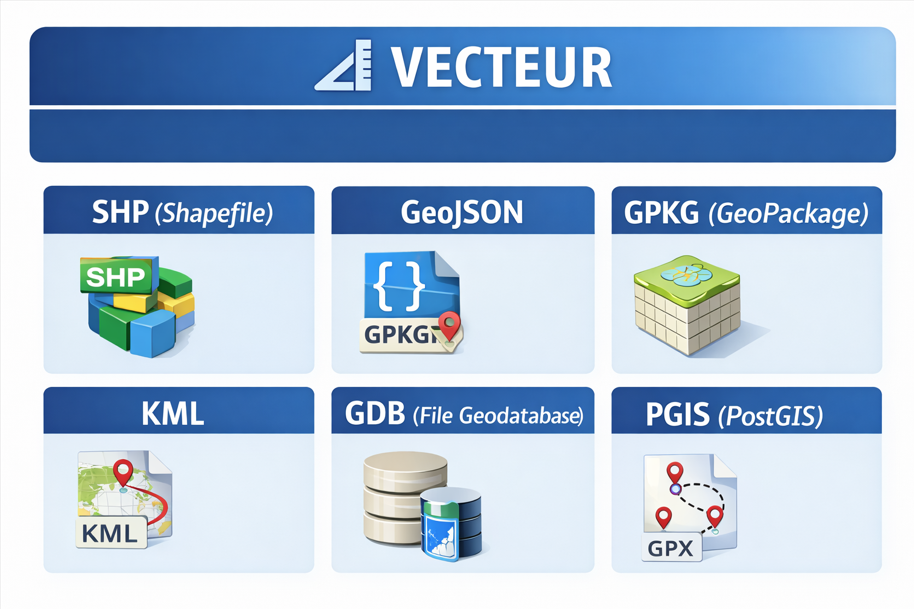

# Accueil

## Les sources 
### Cycles des donnees
# Definition 

elle est au coeur de la conduite de projet en geomatique 
les  etapes du cycles de  la donnee 
Planification
Acquisition 
Verification 
Validation 
Reutilisation 
Archivage
le catologage bonne pratique permet de clarifier les roles en designant qui sont les references de donnees et les simples

### Le cycle de la donnée est au cœur de la conduite de projet en géomatique.
Il regroupe l’ensemble des étapes par lesquelles passe une donnée, de sa création à son archivage.

## Planification

Définition des besoins

Identification des sources

Choix des formats et standards

Organisation des responsabilités

### Acquisition

Collecte terrain

Téléchargement de données (IGN, Open Data, etc.)

Importation dans un SIG

Contrôle initial

## Vérification

Contrôle de cohérence

Détection d’erreurs géométriques

Vérification des attributs

## Validation

Validation technique

Validation métier

Approbation par le responsable du projet

### Réutilisation

Partage au sein de l’équipe

Intégration dans d’autres projets

Publication (Open Data, portail interne)

## Archivage

Sauvegarde

Versioning

Conservation à long terme

### LES SOURCES
[IGN](https://www.ign.fr/institut)
### BD TOPO
[BD TOPO](https://geoservices.ign.fr/bdtopo)

###  PCI Plan Cadastral Informatisé

[PCI](https://www.data.gouv.fr/fr/datasets/plan-cadastral-informatise/)

##  Données environnementales

###  INPN  Inventaire National du Patrimoine Naturel
[INPN](https://inpn.mnhn.fr)
- [ZNIEFF](https://inpn.mnhn.fr/programme/znieff)
- [Natura 2000](https://inpn.mnhn.fr/programme/natura2000)

##  Données énergie

### EDF

- [Open Data EDF](https://opendata.edf.fr)

### GRDF
[réseau gaz](https://opendata.grdf.fr) 

## INTEROPERABILITE 

#  Prise de notes

##  Objectifs

- Comprendre l’importance de l’interopérabilité dans notre discipline.
- Concevoir et intégrer cette notion dans la conduite d’un projet.
- Savoir décrire les principaux web services et leurs usages.

### Définition de l'interopérabilité
On distingue plusieurs degres d'interoperabilité
  ### Les enjeux de l’interopérabilité

- Permettre l’échange de données entre différents logiciels SIG (QGIS, ArcGIS, GeoServer…).
- Assurer la compatibilité entre formats (Shapefile, GeoJSON, GPKG, raster…).
- Faciliter la mutualisation des données entre institutions (IGN, INPN, collectivités, opérateurs énergie).
- Garantir la pérennité des projets dans le temps.
- Éviter les silos de données.

### Web services principaux :

- **WMS** (Web Map Service) → affichage d’images cartographiques.
- **WFS** (Web Feature Service) → accès aux données vectorielles.
- **WMTS** (Web Map Tile Service) → affichage optimisé en tuiles.
- **WCS** (Web Coverage Service) → données raster complètes.
- **CSW** (Catalogue Service for the Web) → recherche de métadonnées.

## OGC

Organisation internationale à but non lucratif dédiée au développement des systèmes ouverts en géomatique.

Elle a été fondée en 1994 pour répondre aux problèmes de non interopérabilité des applications concernant l'information géographique.

### Open Geospatial Consortium (OGC)
### Les missions

- Regrouper les acteurs concernés afin de développer et promouvoir les standards ouverts.
- Garantir l'interopérabilité dans le domaine de la géomatique.
- Favoriser la coopération entre développeurs, fournisseurs et utilisateurs.
- Permettre de réaliser des systèmes et des services d'information complexes et ouverts.
- Impliquer l’ensemble de la communauté dans le processus d’interopérabilité.

## OGC

Site officiel : [OGC – Open Geospatial Consortium](https://www.ogc.org/)

### Fondamental

### Des ressources

- Une plateforme (le site).
- Les standards internationaux assurant l'interopérabilité.
- Des retours d'expériences et bonnes pratiques.
- Une communauté de membres.
- Des rapports et publications scientifiques

## Les Géo standards pour une bonne diffusion

## Le coeur de FAIR

## Parmi les standards de l’OGC

###  Des Webservices (distants)

- WMS - Web Map Service
- WMTS - Web Map Tile Service
- WFS - Web Feature Service
- WCS - Web Coverage Service
- CS-W - Catalog Service Web
- WPS - Web Processing Service

### Des formats (en local)

- SLD - Style Encoding Description
- GML - Geography Markup Language
- KML - Keyhole Markup Language
- GPKG - GeoPackage
- WKT CRS - Notation des CRS en WKT

## Le Catalogage / Métadonnées

Axe de qualité de notre discipline.

La notion de diffusion de donnée a été confirmée par la possibilité de partager des données de qualité.

- Des données de qualité ⇒ exhaustives, propres et géométriquement correctes.
- Des données documentées ⇒ fiches de métadonnées suivant des normes de rédaction (ISO 19115 / 19139, INSPIRE, DCAT).
- Des données diffusables ⇒ catalogue de données / métadonnées, Catalogue Service Web (CSW).
- Des données réutilisables ⇒ accessibles, ouvertes.

## Extract Transform Load
### Un outils fiable => le traitement automatisé

Extact : le processus d'extraction doit convertir les données dans un format adapté à une transformation ultérieure

Transform : Nettoyage, Filtrage, Enrichissement, Division, (spliting), Regroupement.

Load : Les données transformées peuvent être chargé dans la base cible.

## Les formats de données

### Objectifs

À partir de différents logiciels (QGIS, ogr2ogr), aborder les multiples formats utilisés en géomatique.
L'information géographique utilisée en géomatique se décline en deux types de données : les données vecteurs et les données rasters.

Les logiciels SIG vont stocker ces données vecteurs et rasters dans des fichiers dont le format est varié en fonction des logiciels.

## Les formats utilisés en géomatique

Georezo a listé tous les formats utilisés :  
[Liste des extensions – Georezo](https://georezo.net/wiki/main/donnees/extensions)

Cette liste n'est pas forcément exhaustive et beaucoup de formats ne sont pas ou peu utilisés dans la pratique (logiciels obsolètes, formats non utilisés en France).

## RASTER 
Source (SCAN, aérien, spatial, radar,lidar,drone)

## VECTEUR (SHP, GEOJSON, GPKG, KML,GDB, PGIS,GPX)

##  VECTEUR

