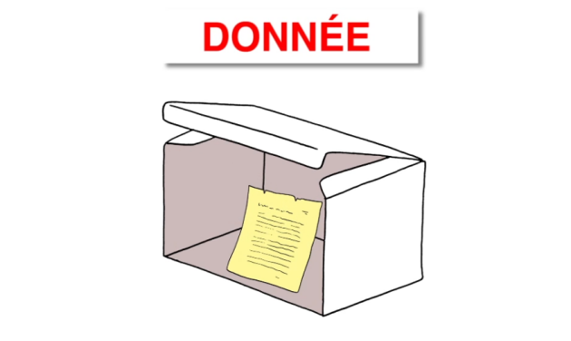
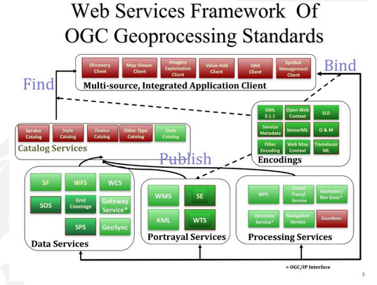
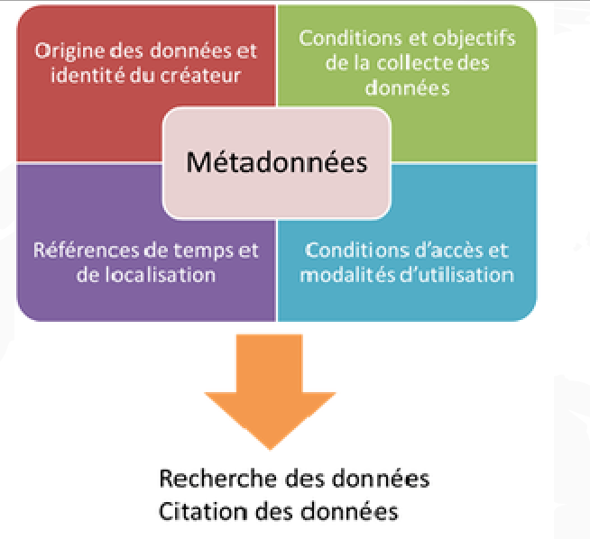
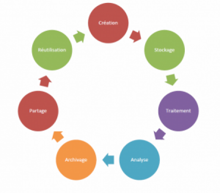

## Objectifs
Cerner les enjeux des métadonnées

Maîtriser le contexte des métadonnées dans l'information géographique

Comprendre l'enjeu du partage des (méta)données

On fait tous des métadonnées !
Parce que ça ne se voit pas forcément
=> le contenu du mail étant la donnée,

tout ce qu'il y a avec ...

## Métadonnée ?
Fondamental
Wikipedia - Premier paragraphe
Source : https://fr.wikipedia.org/wiki/M%C3%A9tadonn%C3%A9e

Une métadonnée (mot composé du préfixe grec meta, indiquant l’auto-référence ; le mot signifie donc proprement « donnée de/à propos de donnée ») est une donnée servant à définir ou décrire une autre donnée quel que soit son support (papier ou électronique).

## Exemple
Un prompt IA :
Bonjour, que peux-tu me dire des métadonnées dans l'information géographique ?

https://chatgpt.com/share/66ea98cf-8734-8004-8690-11574ccc7846

On a une réponse à notre question, ça cerne les grandes lignes. Entrons dans le détail !

## Définition
Métadonnée signifie « donnée sur la donnée », et c'est le terme utilisé pour décrire l'information descriptive d'un jeu de données.

Les métadonnées décrivent les données spatiales mais aussi les tableaux, les cartes, les documents divers, ...

Les métadonnées doivent répondre aux question basiques: quoi, qui, où, quand, pourquoi et comment concernant les données décrites.

Son contenu rend l'identification et la localisation des données correspondante possible : authentification, la nature, la date de la donnée, droit d'utilisation et de diffusion....

Traduit une volonté de gouvernance de la donnée

Une clé de lecture pour trouver, comprendre et analyser les données.

Intérêts des métadonnées
Simplifier la recherche de la donnée

Permettre l'ouverture des données au public

Améliorer l'interopérabilité

Renforcer la gestion et l'archivage des données

## Les métadonnées sont utiles pour toutes les sortes d'utilisateurs de la donnée :

- Le producteur de la donnée qui assure ainsi la valeur et la pérennité de la donnée, et pour son organisation qui évitera ainsi la duplication des efforts alloués à la création de la donnée.

- Pour les utilisateurs potentiels qui cherchent une information et souhaitent évaluer l'intérêt d'un jeu de données pour un usage particulier.

- Le premier rôle des métadonnées est de fournir la liste des ressources informationnelles disponibles, sous la forme d'un catalogue, et de faire un choix parmi ces ressources.

- Le second rôle des métadonnées est de fournir à l'utilisateur d'une ressource toute l'information utile à son bon usage.

- La saisie de métadonnées sert généralement plusieurs objectifs
- Le maintient de la mémoire sur le patrimoine informationnel : la description et la qualification des données détenues répondent d'abord à un besoin de préservation de la connaissance sur ces ressources. Les métadonnées permettent ainsi de garder la mémoire sur la nature des ressources, leur qualité, leurs droits d'usage, les acteurs concernés ...

- Un besoin opérationnel interne  : les métadonnées permettent aux utilisateurs internes d'accéder au patrimoine d'information disponible dans le service par le biais de catalogues de données, de documents techniques extraits des métadonnées ... Le service dispose ainsi d'une description minimum, partagée et stabilisée des données disponibles. Tout nouvel utilisateur peut facilement s'informer sur les ressources disponibles. Les métadonnées permettent éventuellement de renvoyer à des documents plus détaillés (conventions, documentation technique ...).

- L'information des utilisateurs externes : Les métadonnées permettent de la même façon de fournir à des utilisateurs externes les principales informations sur les données que le service est susceptible de lui fournir. De la même manière qu'en interne, le catalogue externe, qui présente les données disponibles, propose les informations principales nécessaires à un tiers pour juger de l'intérêt du produit. Lors de la diffusion, une fiche de métadonnée correspondant aux données livrées permet d'informer formellement l'utilisateur final. Sont ainsi fournit tous les renseignements utiles à la bonne exploitation de la ressource, en particulier sur le sens à donner aux informations disponibles dans le fichier de données, la qualité de ces données, le contact chez le producteur ...

## Trois niveaux de contenu des métadonnées
- Les métadonnées pour la découverte permettent d'identifier les ressources disponibles et d'estimer si elles peuvent répondre à un besoin particulier. Elles donnent le minimum d'information suffisant à un acteur pour repérer parmi les ressources disponibles celles qui éventuellement correspondent à son besoin.

- Les métadonnées pour l'exploration caractérisent avec plus d'éléments détaillés les ressources disponibles et permettent aux utilisateurs de choisir parmi celles sélectionnées précédemment celles répondant effectivement à leur besoin avant de demander à en disposer.

- Les métadonnées pour l'exploitation fournissent l'ensemble des métadonnées utiles au bon usage de la donnée. Elles permettent par exemple d'intégrer ces données dans son système d'information ; elles fournissent les informations sur la qualité et le sens des informations, utiles à un bon usage des données. Elles sont communiquées en même temps que les données.

## Quelle forme pour les métadonnées?
- La structure des métadonnées doit répondre à un standard : Cela simplifie la lecture et analyse des métadonnées

- Les standards sont développés dans le cadre d'une procédure consultative auprès d'experts reconnus.

- Cette procédure est menée par des organismes de standardisation (Ex ISO)

 - Des logiciels permettent l'implémentation des standards

- Pour qui écrire des métadonnées ?
Différents publics, différents besoins
Soi-même --> Prises de notes, garder des traces

- Collègues

- Savoir qu'elle existe (ne pas refaire le boulot 2 fois)

## Auteur ? De quoi est faite le donnée ?

Partenaires (organismes, entreprises)

-Droits d’utilisation ?

-Qui contacter ?

- Comment obtenir la donnée ?

- Etat, Union Européenne

- contraintes de catalogage

- besoin d'interopérabilité transfrontalière (INSPIRE)

- Comment faire pour simplifier le partage des données ?
## Rassembler les (meta)données dans des catalogues avec moteur de recherche

-Normaliser le contenu (ISO 19115)

- Normaliser la forme (ISO 19139)

- Normaliser le contenu : définir des bases communes (INSPIRE)

- Normaliser la diffusion (CSW, Catalog Service for the WEB)

## Définition
Qu'est-ce qu'un catalogue ?
Catalogues 1.0 :

les anciennes bibliothèques, classeur de fiches papier.

un catalogue papier (catalogue d’un magasin)

livre de recettes, avec index à la fin

Catalogues modernes :

site web avec moteur de recherche & gestion des entrées
Les standards de métadonnées
Historique
En 1998, afin de permettre à la communauté française de s'approprier la norme européenne ENv 12657, le CNIG et l'AFNOR ont traduit la norme européenne en norme française, en l'accompagnant de la proposition d'un profil français, version réduite de la norme.

Le CERTU a alors réalisé à la demande du CNIG un outil logiciel libre de droit permettant de gérer des métadonnées conformément à ce profil : REPORTS. Des évolutions de l'outil ont été réalisées par l'Équipement, en s'appuyant sur les besoins de la communauté des utilisateurs

Dés les années 2000 un groupe de travail de l'ISO (le TC 211) a travaillé à la normalisation sur l'information géographique, dont les métadonnées. Les réflexions européennes de normalisation se sont donc orientées vers une intégration des normes ISO dans les normes européennes, dés que cela a été possible.

La norme ISO 19115 a été publiée en 2003.

Début 2005, cette norme a été adoptée comme norme européenne sous l'appellation EN ISO 19115. Elle a fait l'objet d'un profil français, défini par un groupe de travail CNIG-DGME. Ce profil a été validé en commission des référentiels du CNIG en mi 2006.

Dans une démarche similaire à celle qui avait présidé au développement de REPORTS, la DGME a jugé important de faire développer un outil libre de catalogage, Géosource, afin de faciliter l'appropriation de la norme ISO 19115 et son usage par le plus grand nombre d'acteur.

Enfin, la directive européenne INSPIRE, publiée en 2007, institue la première obligation formelle de disposer de métadonnées ISO 19115 harmonisées, libres d'accès, afin de faciliter l'usage des données géographiques liées à l'environnement. Elle en fait un des pivots de son infrastructure géographique.
Trois standards principaux pour les métadonnées :
ISO 19115 : normalise le contenu des métadonnées

ISO 19139 : normalise la syntaxe xml des métadonnées

Catalogue Service for Web (CS-W) : permet d'interroger et lire un géo-catalogue en ligne

OGC (Open Geospatial Consortium) a adopté l'ISO 19115/ISO 19139 en tant que modèle de métadonnées pour les travaux du consortium

Le standard ISO 19115 a été sélectionné par INSPIRE comme base pour la création de métadonnées (voir guide technique INSPIRE sur la règle de mise en œuvre des métadonnées)

ISO 19115 : le plus utilisé en Europe

Comporte plus de 300 entrées de métadonnées

22 de ces entrées constituent le profil ISO Core, le noyau du standard

Profil Core ISO (22 éléments = 7 obligatoires et 15 optionnels)

Les critères obligatoires permettent de répondre aux questions Qui ? Quoi ? Quand ? Où ? relatives à la données. Les critères optionnels servent à garantir l'interopérabilité de la données.

Le dernier de la série : le format DCAT
L'ambition de DCAT est de faciliter l'interopérabilité entre les catalogues et les données publiés sur le web.

Discuté depuis 2016, publié en 2019 et une version3 en 2024.

DCAT-AP : Data Catalog Vocabulary - Application Profile

La documentation officielle de description de la norme DCAT => https://www.w3.org/TR/vocab-dcat-3/

La documentation de data.gouv.fr https://doc.data.gouv.fr/moissonnage/dcat/

Les résultats des travaux des groupes de travail est consultable sur le dépôt Github. Exemple ici du mappage des items Inspire vers le DCAT :

[https://github.com/cnigfr/metadonnee/tree/main/MappingINSPIRE-DCAT]

GeoDCAT-AP
GeoDCAT Application Profile for data portals in Europe

Mise à jour du 23/02/2026

Extension Géo du DCAT-AP

Il ne s'agit pas de remplacer INSPIRE mais d'apporter plus d'outils pour garantir l'interopérabilité en se basant sur le syntaxe RDF.

Guide de mise en oeuvre (fr)

https://docs.google.com/document/d/1qMDqBjrTJVu3t9RH94aLSW7Z3jhH1SjoBrWhW9PZkJ4/edit?tab=t.0#heading=h.3jk5zayjv294

Remarque
Le CNIG : GT Métadonnées
Le CNIG participe à la réflexion et a un Groupe de Travail dédié au sujet. On y retrouve les ressources complètes de leur travaux : http://cnig.gouv.fr/?page_id=291

Un projet de mapping du schéma INSPIRE vers DCAT => https://github.com/cnigfr/metadonnee/tree/main/MappingINSPIRE-DCAT

On y trouve également un guide de saisie pour remplir des éléments Inspiro Compatibles : http://cnig.gouv.fr/wp-content/uploads/2019/12/Guide-de-saisie-des-%C3%A9l%C3%A9ments-de-m%C3%A9tadonn%C3%A9es-INSPIRE-v2.0-1.pdf

Syntaxe RDF
Définition
Resource Description Framework (RDF)

Le RDF est le langage de base du Web Sémantique

https://fr.wikipedia.org/wiki/Resource_Description_Framework

Méthode
Comment ça marche ?
Un document structuré en RDF est un ensemble de triplets.

Un triplet RDF est une association (sujet, prédicat, objet), comme dans la linguistique :

le « sujet » représente la ressource à décrire ;

le « prédicat » représente un type de propriété applicable à cette ressource ;

l' « objet » représente une donnée ou une autre ressource : c'est la valeur de la propriété.

Toulouse Métropole peut-être abréger « Tlse-Met ».

## Quelle forme pour les métadonnées?

Dans le cadre de la norme ENV ISO 19115, les métadonnées portent plus particulièrement sur le contenu :

- des informations d'identification de la ressource : intitulé, description, dates de référence, version, résumé, intervenants

- des informations plus techniques : la description de l'étendue géographique de la ressource, des aperçus, des informations sur les emplois possibles, systèmes de projection ...

- des informations sur la qualité, organisées en :

- mesures de qualité relatives aux critères habituels : précision géométrique, temporelle et sémantique, exhaustivité, cohérence logique ;

- informations de généalogie : description des sources et des processus appliqués aux sources.

- des informations sur les modalités de diffusion : coût de diffusion, modes d'accès, supports, formats, contraintes légales ...

- des informations sur les métadonnées elles mêmes : date de rédaction, auteur, langue ...

- Voyons les règles de mise en œuvre des métadonnées et les éléments de métadonnées

1. IDENTIFICATION
1.1. Intitulé de la ressource

Nom caractéristique et souvent unique sous lequel la ressource est connue.

1.2. Résumé de la ressource

Bref résumé narratif du contenu de la ressource.

1.3. Type de ressource

Type de ressource décrit par les métadonnées.

1.4. Localisateur de la ressource

Le localisateur de la ressource définit le ou les liens avec la ressource et/ou le lien avec les informations supplémentaires concernant la ressource.

Le domaine de valeur de cet élément de métadonnées est une chaîne de caractères couramment exprimée sous forme de localisateur de ressource uniforme (Uniform Resource Locator, URL).

1.5. Identificateur de ressource unique

Une valeur identifiant la ressource de manière unique.

Le domaine de valeur de cet élément de métadonnées est un code obligatoire sous forme de chaîne de caractères, généralement attribué par le propriétaire des données, et un espace de noms sous forme de chaîne de caractères qui identifie de manière unique le contexte du code d'identification (par exemple le propriétaire des données).

1.6. Ressource couplée

Si la ressource est un service de données géographiques, cet élément de métadonnées identifie, le cas échéant, la série ou les séries de données géographiques cibles du service grâce à leurs identificateurs de ressource uniques (Unique Resource Identifiers, URI).

1.7. Langue de la ressource

La langue ou les langues utilisées dans le cadre de la ressource

2. CLASSIFICATION DES DONNÉES ET SERVICES GÉOGRAPHIQUES
2.1. Catégorie thématique

Ce champ permet de classer la ressource dans une ou plusieurs catégories d'une liste fermée et internationale, facilitant ainsi la recherche de cette donnée. Il est important d'associer la ressource à la (ou les) thématique la plus pertinente.

2.2. Type de service de données géographiques

Cas habituels :

Un service CSW est un « service de recherche »,

un service WMS est un « service de consultation »

et un service WFS est un « service de téléchargement ».

Un service WPS faisant du géotraitement (par exemple : chaînage de d'éléments hydrographiques ou croisement de couche) sera de type « autre ».

3. MOT CLÉ
Liste de mots-clés (s'inspirer du site https://www.eionet.europa.eu/gemet/en/inspire-themes/)

4. SITUATION GÉOGRAPHIQUE
4.1. Rectangle de délimitation géographique

Étendue de la ressource dans l'espace géographique, exprimée sous la forme d'un rectangle de délimitation.

Ce rectangle de délimitation est défini par les longitudes est et ouest et les latitudes sud et nord en degrés décimaux, avec une précision d'au moins deux chiffres après la virgule.

5. RÉFÉRENCE TEMPORELLE
Au moins un des éléments de métadonnées indiqués aux points 5.1 à 5.4 devra être fourni.

5.1. Étendue temporelle

L'étendue temporelle définit la période de temps couverte par le contenu de la ressource. Cette période peut être exprimée de l'une des manières suivantes:

une date déterminée,

un intervalle de dates exprimé par la date de début et la date de fin de l'intervalle,

un mélange de dates et d'intervalles.
5.2. Date de publication

Date de publication de la ressource lorsqu'elle est disponible ou date d'entrée en vigueur. Il peut y avoir plus d'une date de publication.

5.3. Date de dernière révision

Date de la dernière révision de la ressource, si la ressource a été révisée. Il ne doit pas y avoir plus d'une date de dernière révision.

5.4. Date de création

Date de création de la ressource. Il ne doit pas y avoir plus d'une date de création.

6. QUALITÉ ET VALIDITÉ
6.1. Généalogie

La généalogie fait état de l'historique du traitement et/ou de la qualité générale de la série de données géographiques.

Le cas échéant, elle peut inclure une information indiquant si la série de données a été validée ou soumise à un contrôle de qualité, s'il s'agit de la version officielle (dans le cas où il existe plusieurs versions) et si elle a une valeur légale.

6.2. Résolution spatiale

La résolution spatiale se rapporte au niveau de détail de la série de données. Elle est exprimée comme un ensemble de valeurs de distance de résolution allant de zéro à plusieurs valeurs (normalement utilisé pour des données maillées et des produits dérivés d'imagerie) ou exprimée en échelles équivalentes (habituellement utilisées pour les cartes ou les produits dérivés de cartes).

7. CONFORMITÉ
Les exigences en ce qui concerne la conformité et le degré de conformité avec les règles de mise en œuvre adoptées par INSPIRE:

7.1. Spécification

Indication de la référence des règles de mise en œuvre de la directive ou des autres spécifications auxquelles une ressource particulière est conforme.

Une ressource peut être conforme à plusieurs règles de mise en œuvre adoptées par la directive ou à d'autres spécifications.

Cette indication inclut au moins le titre et une date de référence (date de publication, date de dernière révision ou de création) des règles de mise en oeuvre adoptées par la directive ou des autres spécifications auxquelles la ressource est conforme.

7.2. Degré

Degré de conformité de la ressource par rapport aux règles de mise en œuvre adoptées par la directive ou à d'autres spécifications.

8. CONTRAINTES EN MATIÈRE D'ACCÈS ET D'UTILISATION
Une contrainte en matière d'accès et d'utilisation peut être l'un des deux éléments suivants ou les deux :

8.1. Conditions applicables à l'accès et à l'utilisation

Cet élément de métadonnées définit les conditions applicables à l'accès et à l'utilisation des séries et des services de données géographiques, et, le cas échéant, les frais correspondants.

Cet élément doit avoir des valeurs. Si aucune condition ne s'applique à l'accès à la ressource et à son utilisation, on utilisera la mention «aucune condition ne s'applique». Si les conditions sont inconnues, on utilisera la mention «conditions inconnues».

Cet élément fournira aussi des informations sur tout frais éventuel à acquitter pour avoir accès à la ressource et l'utiliser, le cas échéant, ou fera référence à un localisateur de ressource uniforme (Uniform Resource Locator, URL) où il sera possible de trouver des informations sur les frais.

8.2. Restrictions concernant l'accès public

Lorsque les producteurs restreignent l'accès public aux séries et aux services de données géographiques, cet élément de métadonnées fournit des informations sur les restrictions et les raisons de celles-ci.

S'il n'y a pas de restrictions concernant l'accès public, cet élément de métadonnées l'indiquera.

9. ORGANISATIONS RESPONSABLES DE L'ÉTABLISSEMENT, DE LA GESTION, DE LA MAINTENANCE ET DE LA DIFFUSION DES SÉRIES ET DES SERVICES DE DONNÉES GÉOGRAPHIQUES
9.1. Partie responsable

Description de l'organisation responsable de l'établissement, de la gestion, de la maintenance et de la diffusion de la ressource.

Cette description inclut:

description sous forme de texte libre,

une adresse e-mail de contact sous la forme d'une chaîne de caractères.

9.2. Rôle de la partie responsable

Fonction de l'organisation responsable.

La norme EN ISO 19115 identifie les responsabilités élémentaires suivantes : le fournisseur, le gestionnaire, le propriétaire, l'utilisateur, le distributeur, le commanditaire, le point de contact, le maître d’œuvre principal (ou d'ensemble), l'exécutant secondaire, l'éditeur et l'auteur.

Ces responsabilités élémentaires recouvrent d'autres notions très utilisées en France, notamment :

Le maître d'ouvrage correspond généralement au commanditaire de la ressource et peut accessoirement en être le propriétaire ;

Le producteur en tant que fabricant correspond au maître d’œuvre principal ;

L'intégrateur de la ressource peut correspondre au gestionnaire et/ou maître d’œuvre principal de la ressource.

10. ## MÉTADONNÉES CONCERNANT LES MÉTADONNÉES
10.1. Point de contact des métadonnées

Description de l'organisation responsable de la création et de la maintenance des métadonnées. Cette description inclut:

le nom de l'organisation sous forme de texte libre,

une adresse e-mail de contact sous la forme d'une chaîne de caractères.

- 10.2. Date des métadonnées

Date à laquelle l'enregistrement de métadonnées a été créé ou actualisé.

- 10.3. Langue des métadonnées

C'est la langue dans laquelle les éléments de métadonnées sont exprimés

### Le Guide complet de saisie des fiches INSPIRE (93 pages)
https://cnig.gouv.fr/IMG/pdf/guide-de-saisie-des-elements-de-metadonnees-inspire-v2.0-1.pdf

Le guide allégé (53 pages) :

https://cnig.gouv.fr/IMG/pdf/guide-de-saisie-des-elements-de-metadonnees-inspire-v2.0-allege.pdf

## Le XML (eXtensible Markup Language)
Les métadonnées sont stockées au format XML :

Un standard (ISO 19139) pour manipuler et échanger sur les différentes plate-formes, sur le web, ....

Structure de balises qui lui permet d'être reconnu et interpréter par une multitude d'outils.

Langage standardisé, simple et configurable.

## Quels outils pour les métadonnées?

- Outils de création de métadonnées:

- Excel, Acces, Libre Office base

- QGIS, Propriétés de la couche/Métadonnées, plugin PgMetadata (en lien avec lizmap), QSphere, Plume
- ArcCatalogue (ESRI)
## Outils de catalogage:

GeoNetwork :

GeoNetwork est une solution de catalogage Open Source de gestion des métadonnées SIG en mode client / serveur. Elle se base sur de nombreuses normes internationales pour le stockage et l'échange de métadonnées (ISO, OGC, etc.). C'est une application en très fort développement et disposant d'une communauté grandissante. Un site internet : https://geonetwork-opensource.org/

- Exemple : le geocatalogue de la FAO

- CKAN : Compréhensive Knowledge Archive Network

- Un solution très utilisée pour les portails open-data (https://africaopendata.org/dataset)

- Un projet Open source dynamique

## 2 grand types de catalogues
-Les catalogues Open Data : des catalogues simples

-Les catalogues de données Géographiques/compatibles INSPIRE, plus complexes

### Comment se retrouver dans l'immensité des catalogues de données ?
Une question d'actualité et d'avenir !

Laurent Jégou Enseignant / Chercheur de l'université de Toulouse 2 vient de publier un travail collaboratif avec la parution récente du site « Sources de données pour le diagnostic teritorial » https://www.geotests.net/donnees_diag/

Conseil
Une donnée provient d'un référent producteur de cette donnée !
Par exemple, le découpage administratif en France = IGN, produit « Admin Express »

... @vous

Fondamental
Un site avec des archives
https://files.opendatarchives.fr/

## Les catalogues Open Data : des catalogues simples
Des métadonnées simplifiées

Une gestion des droits simplifiée (données ouvertes)

Plus orientés donnée

Proposent souvent de la dataviz

Solutions Open-Source : CKAN, uData

Solutions propriétaires : OpenDataSoft, Isogeo ?

ex. http://data.gouv.fr

Ou la flambante version béta https://cartes.gouv.fr/catalogue/search

## Les catalogues de données Géographiques/compatibles INSPIRE
Des métadonnées normalisées, plus riches, mais plus complexes

Plus orientées Géospatial

Plus orientées métadonnée

Une gestion des droits avancée

Solution open-source : GeoNetwork

ex.https://www.pigma.org/geonetwork/srv/fre/catalog.search#/home

## Conclusions
Nécessaires pour l’utilisation et le partage des donnée

Plusieurs normes, encore en évolution "rapide"

Enjeux :

Organiser les données : Catalogues, standards

Libérer les données : Open data

Une vision numérique du monde
